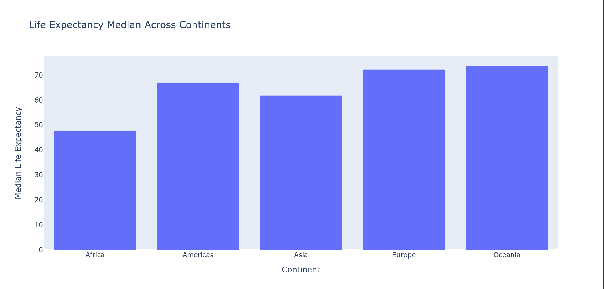

 After analysing the provided dataset, I obtained several intriguing narratives highlighting crucial relationships among countries regarding development, health, and geography. 

Narrative 1: Distributions of Populations and Their Corresponding Development Levels Among Continents
===============================================================================================

The above graph shows the distribution of populations grouped by continents against the respective logarithmic scale of GDP per capita. We notice a wide range of variations in wealth levels across different regions. Africa appears relatively poorer compared to others, while Europe enjoys higher average income levels. Additionally, Asia contains significant disparities, ranging from very rich nations to extremely impoverished ones.

Furthermore, some densely populated countries, particularly in Asia, dominate most areas due to their large populations. However, once considering the human density factor via GDP per capita, smaller yet wealthy European nations rise proportionally alongside larger economies.

Narrative 2: Health Improvements Over Time Across Various Regions
==========================================================

This time series depicts how overall life expectancies evolved over the years, stratified by region. During the latter half of the twentieth century, there seems to be a remarkable surge in healthcare advancement, leading to increased longevity almost universally. Nevertheless, Africa trails considerably behind other continents, suggesting substantial challenges still exist related to poverty alleviation, sanitation improvements, and disease control.

Remarkably, despite experiencing rapid economic growth since the late 1900s, South America hasn't caught up entirely with Western Europe concerning general health conditions. Although progress occurs steadily, regional socioeconomic factors hinder faster advances towards parity with developed nations.

Conclusion
==========

These narratives only scratch the surface of possible insights derived from the comprehensive Gapminder dataset. Further investigation may reveal compelling trends linking demographic changes, environmental aspects, political environments, technological developments, education quality, global trade dynamics, and much more. Ultimately, merging robust analytical frameworks offered by Pandas and visually appealing representations enabled by Plotly provides researchers valuable means to communicate complex ideas effectively.